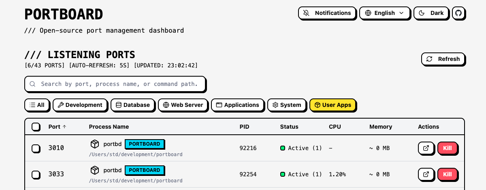

# Portboard

An open-source, browser-based port management dashboard for developers.



## Overview

**Portboard** is a security-first port management tool built with modern web technologies. Inspired by tools like pgweb and Drizzle Studio, it provides a clean web interface for monitoring listening ports and managing processes on your local machine.

### Why Portboard?

Today's developers ship code faster than ever thanks to AI tools like Cursor, Claude Code, Codex, and GitHub Copilot.
But as AI starts spinning up dev servers automatically… a new pain emerges:

**⚠️ The New Reality: Port Chaos**
- AI assistants silently start multiple dev servers
- The same project launches three times without you noticing
- "Port 3000 is already in use" becomes a daily ritual
- You kill the wrong process and break your entire session
- You start running `lsof -i :3000 | grep LISTEN` like muscle memory
- Docker containers expose ports you forgot existed
- You lose track of what's running where—and why

**AI accelerated development.**
**But it also accelerated port conflicts.**

---

**🚀 The Solution: Portboard**

Portboard gives you a single, intelligent dashboard for all active ports on your machine:
- See every listening port at a glance
- Identify real process names (no more truncated gibberish)
- Detect macOS .app icons to show which app is actually running
- Surface the working directory and project name
- Kill processes safely with built-in context
- Open IDEs, Terminal, or Finder directly from the port
- Detect Docker containers and shell into them instantly
- Copy localhost or network URL in one click

**Portboard is built for the new AI-powered workflow where ports spin up faster than humans can track them.**

### Key Features

- 🔍 **Enhanced Port Monitoring**: Real-time display with intelligent process identification
  - Full process names without truncation
  - Application name extraction from macOS .app bundles
  - **Application icon display** with native .icns extraction and caching
  - Project name detection from package.json for CLI tools
  - Smart command path display (filters out unhelpful truncated paths)
  - **Working directory (cwd) display** for non-Docker processes
  - **Connection status tracking**: Real-time display of active connections vs idle ports
    - Accurate server-side connection counting (filtered by PID)
    - Active/Idle status badges with connection count
    - **Optimized batch processing** for fast performance (~1 second load time)
  - **Clean table interface**: Simplified view showing only essential information
    - Core columns: Port, Process Name, PID, Status, CPU, Memory, Actions
    - **Open in Browser**: Quick access button to open port URL in default browser (hidden on small screens)
    - **Responsive design**: Optimized layout for different screen sizes
      - Small screens (< 1024px): Shows Port, Process Name, and Actions only
      - Large screens (≥ 1024px): Shows all columns including PID, Status, CPU, Memory
    - Click rows to open detailed modal with full information
  - Category-based filtering (Development, Database, Web Server, Applications, System, User Apps)
  - Search functionality across ports, processes, and commands
  - Multi-column sorting (Port, Process Name, PID, Connection Status, CPU, Memory)
- ⚡ **Smart Process Control**: Kill processes with confirmation dialogs
  - **Docker Container Management**: Safe Docker port handling
    - Automatic detection of Docker container ports
    - Warning about docker-proxy process kill risks
    - **Stop Container**: Gracefully stop individual containers
    - **Stop Compose Project**: Stop entire docker-compose projects
    - Advanced option to kill docker-proxy (not recommended)
  - **Batch kill functionality**: Select and kill multiple processes at once
    - Checkbox selection for individual ports
    - "Select All" / "Deselect All" for quick selection
    - Visual batch operations toolbar with selected count
    - Batch kill confirmation dialog with detailed process information
    - **Docker-aware batch operations**: Automatically uses safe stop commands for Docker containers
    - Four-level warning system (Docker info, System, Development, Active connections)
    - Parallel kill execution with success/failure reporting
    - Smart success messages: "2 containers stopped, 1 process killed"
  - Subtle ghost buttons for system/development processes to prevent accidental kills
  - Destructive red buttons for user processes
  - Category-aware warnings in confirmation dialogs
- 🔄 **Auto-refresh**: Real-time monitoring with 5s interval
  - Last updated timestamp display (HH:MM:SS format)
  - Scroll position preservation during auto-refresh
- 📋 **Enhanced Detail Modal**: Click any row to view full port information
  - Scrollable content area with proper padding and right-aligned scrollbar
  - Sticky header with application icons
  - Full process details including:
    - **Process start time and uptime** display
    - Working directory (cwd) for execution context
    - Command path for binary location
    - Docker container information (image, config, ports)
    - Resource usage (CPU, Memory, RSS)
  - **Quick Actions**: Browser and network integration
    - **Open in Browser**: Launch port URL in default browser (http://localhost:PORT)
    - **Copy Network URL**: Copy network-accessible URL to clipboard (http://LOCAL_IP:PORT)
  - **IDE/Terminal/Finder Integration** (macOS): Open working directory in your favorite tools
    - **Finder**: Quick access to directory in macOS Finder
    - Auto-detection of installed IDEs (Cursor, VS Code, WebStorm, IntelliJ, etc.)
    - Auto-detection of terminal apps (Ghostty, iTerm2, Warp, Terminal, etc.)
    - Three-section dropdown menu with category labels (Finder, IDEs, Terminals)
    - Application icons displayed in dropdown menu
    - Dynamic detection using macOS Spotlight (mdfind)
    - Copy directory path to clipboard
    - **Docker container support**:
      - Open docker-compose project directory in IDE/Finder
      - Open interactive shell inside container with `docker exec`
  - **Docker Container Logs Viewer**: Real-time log viewing for Docker containers
    - Auto-fetch logs when collapsible section is opened
    - **Configurable line count**: Select 20/50/100/200 lines dynamically
    - **Follow mode**: Auto-refresh logs every 5 seconds for real-time monitoring
    - Manual refresh button with loading indicator
    - Collapsible log viewer with brutalist styling (controlled state)
    - Log level detection (error, warn, info) with color coding
    - Per-container log fetching (correct handling of docker-compose projects)
    - Loading states and error handling
  - Docker port mapping display (Host:Container format, e.g., 3000:80)
  - Timestamp display in modal footer
- 🎨 **Neo Brutalism Design**: Bold, high-contrast UI with distinctive visual style
  - Custom brutalist components wrapping shadcn/ui (Button, Table, Dialog, DropdownMenu, Checkbox, Collapsible, Select, Tooltip)
  - Strong borders, offset shadows, and geometric shapes
  - Brutalist color scheme (yellow, cyan, red accents)
  - Custom scrollbar styling with transparent track and background
  - Sonner toast notifications with brutalist styling
  - Contextual tooltips for improved UX (notification settings, etc.)
  - Optimized light mode background for better visual clarity
- 🌙 **Dark Mode**: Full dark mode support with theme toggle
- 🌐 **Internationalization (i18n)**: Multi-language support
  - English and Japanese language support
  - Language selector with persistent preference (localStorage)
  - Comprehensive translations across all UI components
  - Easy to add new languages via JSON translation files
- 🔔 **Desktop Notifications**: Get notified when new ports are opened
  - **Notification toggle**: Enable/disable with Bell icon in settings (with helpful tooltip)
  - **Auto-detection**: Automatically detects new ports after initial load
  - **Smart filtering**: Excludes Portboard's own ports (3033, 3000)
  - **Multi-port support**: Groups multiple new ports into single notification
  - **Test notification**: Shows welcome notification when enabling
  - **Auto-close**: Notifications dismiss after 5 seconds
  - **Persistent settings**: Preference saved in localStorage
  - **Improved UX**: Enhanced toast messages with detailed feedback
  - See [docs/NOTIFICATIONS.md](docs/NOTIFICATIONS.md) for troubleshooting
- 🔒 **Security-First**: Localhost-only binding by default, no telemetry
- 💻 **CLI & MCP Integration**: Terminal and AI-powered workflows
  - **Standalone CLI commands**: `portboard list`, `portboard kill`, `portboard docker ls`
  - **JSON output mode**: Perfect for scripting and automation (`--json` flag)
  - **Port/PID auto-detection**: Kill by port number or PID with smart ambiguity resolution
  - **Interactive confirmations**: Safe process termination with detailed warnings
  - **Docker CLI support**: Container management via terminal (ls/stop/logs with follow mode)
  - **MCP Server**: Model Context Protocol integration for Claude Desktop
    - 6 AI-accessible tools for port management
    - Natural language port operations via Claude
    - Safety checks and protected port handling
  - **Colorful terminal output**: cli-table3 + chalk for beautiful tables
  - **Figlet startup banner**: Eye-catching ASCII art on launch
  - See [docs/CLI.md](docs/CLI.md) and [docs/MCP.md](docs/MCP.md) for details

### Security Principles

- **Localhost-only** binding by default
- **Docker socket access disabled** by default (explicit opt-in required)
- **Own-process-only kills** by default (no sudo/root operations)
- **No telemetry or tracking**

## Tech Stack

### Frontend
- **React 19.2** with TypeScript
- **Vite 7.1.7** for build tooling
- **Tailwind CSS 4** via `@tailwindcss/vite`
- **shadcn/ui** for UI components
- **React Compiler** for automatic optimization
- **react-i18next** for internationalization (i18n)

### Backend & State
- **Hono** - Lightweight web framework
- **Jotai** - Atomic state management
- **SWR** - Data fetching with auto-revalidation
- **Sonner** - Toast notifications
- **Zod** - Runtime validation

### CLI & Automation
- **Commander.js** - CLI framework for command parsing
- **cli-table3** - Beautiful terminal tables
- **chalk** - Terminal color and styling
- **ora** - Elegant terminal spinners
- **figlet** - ASCII art text generation
- **@modelcontextprotocol/sdk** - MCP server for AI integration
- **Platform Abstraction Layer** - Cross-platform OS operations (macOS, Windows, Linux)

### Development Tools
- **TypeScript 5.9** with strict mode
- **tsx 4.20.6** for TypeScript execution
- **Biome 2.3.4** for linting and formatting
- **Node.js** runtime

## Getting Started

### Quick Start with npx

The fastest way to run Portboard:

```bash
npx portbd
```

This will:
- Download and run the latest version of Portboard
- Start the server on `http://localhost:3033` (or auto-increment if busy)
- Automatically open your browser to the dashboard

### CLI Commands

Portboard also provides standalone CLI commands for terminal-based workflows:

```bash
portboard list                    # List all listening ports
portboard list --category=dev     # Filter by category
portboard list --search=node      # Search query
portboard list --json             # JSON output

portboard info <port>             # Show detailed port information
portboard kill <port|pid>         # Kill process by port or PID (Docker-aware: uses stop for containers)
portboard open <port>             # Open port in browser

portboard docker ls               # List Docker containers
portboard docker stop <container> # Stop Docker container
portboard docker logs <container> # View container logs
```

See [docs/CLI.md](docs/CLI.md) for detailed CLI documentation.

### MCP Integration

Portboard provides a Model Context Protocol (MCP) server for AI assistants like Claude Desktop:

**Setup (Claude Desktop):**

Add to your Claude Desktop configuration (`~/Library/Application Support/Claude/claude_desktop_config.json`):

```json
{
  "mcpServers": {
    "portboard": {
      "command": "npx",
      "args": ["portboard-mcp"]
    }
  }
}
```

**Available Tools:**
- `portboard_list_ports` - List all listening ports with filtering
- `portboard_kill_process` - Kill processes with safety checks (Docker-aware: uses stop for containers)
- `portboard_get_port_info` - Get detailed port information
- `portboard_docker_list` - List Docker container ports
- `portboard_docker_stop` - Stop Docker containers
- `portboard_docker_logs` - Fetch container logs

See [docs/MCP.md](docs/MCP.md) for detailed MCP documentation.

### Prerequisites

- Node.js 18+
- npm (comes with Node.js)

### Installation for Development

```bash
# Clone the repository
git clone https://github.com/stdhkr/portboard.git
cd portboard

# Install dependencies
npm install
```

### Configuration

Portboard uses environment variables for configuration. Copy the example file to get started:

```bash
cp .env.example .env
```

Edit `.env` to customize settings:

```bash
# Server Configuration
PORT=3033                    # Backend API port
HOST=127.0.0.1              # Bind address (localhost-only for security)

# Frontend Development Server
VITE_DEV_PORT=3000          # Vite dev server port

# Timing Configuration (optional)
AUTO_REFRESH_INTERVAL=5000  # Port list auto-refresh interval (ms)
DOCKER_LOGS_REFRESH=5000    # Docker logs auto-refresh interval (ms)

# Docker Configuration (optional)
DOCKER_DEFAULT_LOG_LINES=20 # Default number of log lines to fetch

# Icon Configuration (optional)
ICON_CACHE_DIR=portboard-icons  # Icon cache directory name
ICON_RESIZE_SIZE=64            # Icon resize dimensions (pixels)
```

See [`.env.example`](.env.example) for a complete list of available environment variables.

### Development

```bash
# Start both frontend and backend servers (recommended)
npm run dev:all

# Or start only the frontend (requires backend to be running separately)
npm run dev
```

The app will be available at:
- **Frontend**: `http://localhost:3000` (or port specified in `VITE_DEV_PORT`)
- **Backend API**: `http://localhost:3033` (or port specified in `PORT`)

**Note**: Use `npm run dev:all` to run the full application. The `npm run dev` command only starts the Vite frontend server.

### Stopping Portboard

If Portboard is already running and you need to stop it, you have several options:

#### Option 1: Use Portboard itself (Recommended)

1. Open Portboard in your browser (`http://localhost:3033`)
2. Find the port(s) with "PORTBOARD" badge (cyan color)
3. Click the kill button - you'll see a warning that it will terminate the interface
4. Confirm to stop Portboard

#### Option 2: Find and kill the process manually

```bash
# Find Portboard process
lsof -i :3033 | grep LISTEN

# Kill the process (replace <PID> with the actual process ID)
kill <PID>
```

#### Option 3: Kill all Node.js processes on port 3033

```bash
# macOS/Linux
lsof -ti :3033 | xargs kill

# Or use pkill (be careful - this kills all matching processes)
pkill -f "portboard"
```

**Note**: If you're running in development mode with `npm run dev:all`, you may also need to stop the Vite dev server on port 3000:

```bash
lsof -ti :3000 | xargs kill
```

### Building for Production

```bash
# Build the application
npm run build

# Preview the production build
npm run preview
```

## Development Commands

```bash
# Linting
npm run lint          # Run Biome linter
npm run format        # Format code with Biome
npm run check         # Lint + format with auto-fix

# Type checking
npm run typecheck     # Run TypeScript type checker
```

## Architecture

### Platform Abstraction Layer

Portboard uses a platform abstraction layer to support multiple operating systems. This design allows for:

- **Cross-platform compatibility**: macOS, Windows, and Linux support
- **Modular implementation**: OS-specific code is isolated in platform providers
- **Easy extensibility**: New platforms can be added by implementing the provider interfaces
- **Type safety**: TypeScript interfaces ensure consistent APIs across platforms

**Platform Provider Interfaces**:
- `IPortProvider`: Port listing and connection counting
- `IProcessProvider`: Process management and metadata collection
- `IIconProvider`: Application icon extraction
- `IApplicationProvider`: IDE/Terminal detection and launching
- `IBrowserProvider`: Browser integration and network URL generation

**Current Implementation Status**:
- ✅ **macOS**: Full implementation (lsof, ps, sips, mdfind, open)
- ⚡ **Windows**: Improved stub with basic data (netstat, wmic, taskkill)
  - Connection counting and process metadata now functional
  - Still needs: Icon extraction (.ico), IDE detection
- ⚡ **Linux**: Improved stub with basic data (lsof, ps)
  - Connection counting and process metadata now functional
  - Still needs: Icon extraction (.desktop), IDE detection

The platform abstraction layer uses a **singleton pattern** for performance, ensuring that platform providers are instantiated only once. Services access platform functionality through `getPlatformProviderSingleton()`, which automatically detects the current OS and returns the appropriate implementation.

## Project Structure

```
portboard/
├── src/
│   ├── components/
│   │   ├── brutalist/        # Neo Brutalism component wrappers
│   │   │   ├── button.tsx
│   │   │   ├── checkbox.tsx
│   │   │   ├── table.tsx
│   │   │   ├── dialog.tsx
│   │   │   ├── sonner.tsx
│   │   │   ├── copy-button.tsx
│   │   │   ├── dropdown-menu.tsx
│   │   │   ├── select.tsx
│   │   │   ├── collapsible.tsx
│   │   │   ├── tooltip.tsx
│   │   │   └── index.ts
│   │   ├── ui/               # shadcn/ui base components
│   │   ├── port-table/       # Port table components
│   │   │   ├── index.tsx                         # Main table component
│   │   │   ├── port-row.tsx                      # Individual port row
│   │   │   ├── port-detail-dialog.tsx            # Port detail modal
│   │   │   ├── kill-dialog.tsx                   # Kill confirmation dialog
│   │   │   ├── batch-kill-dialog.tsx             # Batch kill confirmation dialog
│   │   │   ├── search-bar.tsx                    # Search input
│   │   │   └── connection-status-indicator.tsx   # Connection status display
│   │   └── settings/         # Settings components
│   │       ├── language-toggle.tsx
│   │       ├── notification-toggle.tsx
│   │       └── theme-toggle.tsx
│   ├── locales/              # Internationalization translation files
│   │   ├── en.json               # English translations
│   │   └── ja.json               # Japanese translations
│   ├── hooks/
│   │   ├── use-port-filtering.ts # Port filtering logic
│   │   └── use-port-sorting.ts   # Port sorting logic
│   ├── config/               # Configuration files
│   │   ├── api.ts            # API URL configuration with env support
│   │   └── constants.ts      # Frontend constants (timing, UI, Docker)
│   ├── constants/
│   │   └── categories.tsx        # Category definitions & icons
│   ├── styles/
│   │   └── brutalism.css         # Neo Brutalism design system
│   ├── lib/
│   │   ├── api.ts                # API functions
│   │   ├── i18n.ts               # i18next configuration
│   │   └── utils.ts              # Utility functions
│   ├── store/
│   │   └── port-store.ts         # Jotai state atoms
│   ├── types/
│   │   └── port.ts               # TypeScript types
│   ├── App.tsx                   # Main component
│   ├── main.tsx                  # Entry point
│   └── index.css                 # Global styles
├── server/
│   ├── config/
│   │   ├── constants.ts          # Backend constants with env support
│   │   └── server-state.ts       # Runtime state (server port tracking)
│   ├── index.ts                  # Hono server entry (development)
│   ├── cli/                      # CLI implementation
│   │   ├── index.ts                  # Main CLI entry point (commander.js)
│   │   ├── commands/
│   │   │   ├── list.ts               # List ports command
│   │   │   ├── info.ts               # Port info command
│   │   │   ├── kill.ts               # Kill process command
│   │   │   ├── docker.ts             # Docker operations
│   │   │   ├── open.ts               # Open in browser
│   │   │   └── serve.ts              # Web UI server
│   │   └── utils/
│   │       ├── banner.ts             # Startup banner (figlet)
│   │       ├── formatters.ts         # Output formatters
│   │       └── output.ts             # Colored output
│   ├── mcp/                      # MCP Server implementation
│   │   ├── index.ts                  # MCP entry point (stdio)
│   │   ├── server.ts                 # MCP Server core
│   │   └── tools/
│   │       ├── list-ports.ts         # List ports MCP tool
│   │       ├── kill-process.ts       # Kill process MCP tool
│   │       ├── port-info.ts          # Port info MCP tool
│   │       ├── docker-list.ts        # Docker list MCP tool
│   │       ├── docker-stop.ts        # Docker stop MCP tool
│   │       └── docker-logs.ts        # Docker logs MCP tool
│   ├── routes/
│   │   ├── ports.ts              # Port endpoints
│   │   ├── icons.ts              # Icon serving endpoint
│   │   └── logs.ts               # Docker container logs endpoint
│   └── services/                 # Modular services
│       ├── platform/                 # Platform abstraction layer
│       │   ├── index.ts                  # Platform provider factory & singleton
│       │   ├── types.ts                  # Platform interface definitions
│       │   ├── macos/                    # macOS implementations
│       │   │   ├── index.ts                  # MacOSPlatformProvider
│       │   │   ├── port-provider.ts          # Port management (lsof)
│       │   │   ├── process-provider.ts       # Process management (ps, kill)
│       │   │   ├── icon-provider.ts          # Icon extraction (sips)
│       │   │   ├── application-provider.ts   # IDE/Terminal detection (mdfind)
│       │   │   └── browser-provider.ts       # Browser & network (open, networkInterfaces)
│       │   ├── windows/                  # Windows implementations (stub)
│       │   └── linux/                    # Linux implementations (stub)
│       ├── port-service.ts           # Main port API (uses platform providers)
│       ├── connection-service.ts     # Connection tracking
│       ├── unix-port-parser.ts       # lsof output parsing
│       ├── process-metadata-service.ts # Process metadata
│       ├── category-service.ts       # Process categorization
│       ├── docker-service.ts         # Docker integration (port mapping, stop, logs)
│       ├── icon-service.ts           # Icon extraction & caching (macOS implementation)
│       ├── ide-detection-service.ts  # IDE/Terminal auto-detection (macOS implementation)
│       └── browser-service.ts        # Browser integration & network URLs
├── dist/                         # Build output (git-ignored)
│   ├── cli.js                        # Main CLI executable (88kb)
│   └── mcp.js                        # MCP Server executable (67kb)
├── public/                       # Static assets (Vite build output, git-ignored)
├── docs/                         # Documentation
│   ├── IMPLEMENTATION_PLAN.md        # MCP & CLI implementation plan
│   ├── MCP.md                        # MCP Server documentation
│   ├── CLI.md                        # CLI reference
│   └── NOTIFICATIONS.md              # Desktop notifications guide
├── .env.example                  # Environment variables template
├── .gitignore                    # Git ignore rules (includes .env)
├── package.json                  # Dependencies
├── vite.config.ts                # Vite configuration (with env loading)
├── CLAUDE.md                     # Developer documentation
└── biome.json                    # Biome configuration
```

See [CLAUDE.md](CLAUDE.md) for detailed architecture documentation.


## Roadmap

### Phase 1: MVP (✅ Completed)
- [x] Project setup with Vite + React + TypeScript
- [x] Tailwind CSS 4 integration
- [x] shadcn/ui setup (Button, Table, Dialog, Tooltip, Badge)
- [x] Neo Brutalism design system implementation
  - [x] Custom brutalist component wrappers
  - [x] Brutalist color scheme and styling
  - [x] Custom scrollbar styling
  - [x] Dark mode support with theme toggle
  - [x] Sonner toast notifications with brutalist styling
- [x] Port listing UI with enhanced process information
- [x] Intelligent process name display
  - [x] Full process names without truncation (lsof +c 0)
  - [x] Escape sequence decoding
  - [x] Application name extraction from .app bundles
  - [x] Application icon display with native .icns extraction
  - [x] Project name detection from package.json
  - [x] Smart command path display with filtering
- [x] Smart process kill functionality
  - [x] **Docker Container Management**: Safe handling of Docker ports
    - [x] Docker container port detection with warnings
    - [x] Stop Container API endpoint (POST /api/ports/stop-container)
    - [x] Stop Compose Project API endpoint (POST /api/ports/stop-compose)
    - [x] Redesigned kill dialog with Docker-specific actions
    - [x] Three action levels: Stop Container, Stop Compose, Kill Process
  - [x] **Batch kill functionality**: Select and kill multiple processes
    - [x] Checkbox selection with "Select All" / "Deselect All"
    - [x] Visual batch operations toolbar
    - [x] Batch kill confirmation dialog with warnings
    - [x] **Docker-aware batch operations**: Auto-stop containers instead of killing docker-proxy
    - [x] Parallel kill execution with success/failure reporting
  - [x] Ghost button variant for system/development processes
  - [x] Destructive button variant for user processes
  - [x] Confirmation dialogs with category-aware warnings
  - [x] **Self-port protection**: Portboard's own ports (API + Vite dev) are flagged with PORTBOARD badge and critical warnings
  - [x] Category-based filtering
  - [x] Search functionality (port, process name, command path)
  - [x] Multi-column sorting with ascending/descending order
- [x] Connection status tracking
  - [x] Real-time detection of active connections using lsof
  - [x] Accurate server-side connection counting (PID-filtered)
  - [x] Active/Idle status badges with connection count
  - [x] Sortable connection status column
- [x] Simplified table interface with detail modal
  - [x] Essential columns: Port, Process Name, PID, Status, CPU, Memory, Actions
  - [x] Click-to-open detail modal with full information
  - [x] Application icons in modal titles
  - [x] Sortable CPU and Memory columns for performance monitoring
  - [x] Working directory (cwd) display for process execution context
  - [x] Process start time and uptime tracking
  - [x] Docker port mapping display (Host:Container format)
  - [x] Improved scrollbar positioning and styling
  - [x] Docker container logs viewer with collapsible UI
    - [x] Auto-fetch logs when collapsible is opened (controlled state with useRef)
    - [x] Per-container log fetching using container ID
    - [x] Log level detection with color coding
    - [x] Timestamp display for each log line
    - [x] Component key-based reset for correct per-port state
    - [x] Configurable line count (20/50/100/200 lines)
    - [x] Follow mode with incremental log fetching using `--since` parameter
    - [x] Direct control flow without useEffect (useRef-based interval management)
- [x] Auto-refresh (5s interval)
- [x] Hono backend server
- [x] Jotai state management

### Phase 1.5: MCP Server (🚧 Planned)

**Goal**: Enable port management from AI-powered development tools (Claude Code, Cursor, Codex, etc.)

**Architecture**: Hybrid approach with shared core logic

```
portboard/
├── server/
│   ├── core/              # Shared core logic (NEW)
│   │   ├── port-manager.ts   # lsof execution, parsing, process management
│   │   └── types.ts          # Common type definitions
│   ├── index.ts           # Hono API server (for GUI)
│   └── mcp.ts             # MCP server (for AI editors, standalone)
```

**Features**:
- [ ] `list_ports`: Retrieve list of listening ports
- [ ] `kill_process`: Kill process with confirmation
- [ ] `get_port_info`: Get detailed information for specific port

**Distribution**:
- npm package: `@portboard/mcp-server` or `portboard-mcp`
- Standalone operation (no Hono server required)

**Benefits**:
- **Code reuse**: Shared logic between GUI/CLI/MCP
- **Standalone**: MCP server runs independently
- **Consistency**: Same data across all interfaces

### Phase 2: Enhanced Features
- [x] Application icon display (macOS only)
  - [x] Native .icns extraction from .app bundles
  - [x] Icon caching in /tmp for performance
  - [x] Fallback to category icons on error
  - [x] Support for nested .app bundles (e.g., Cursor Helper)
  - [ ] Cross-platform support (Windows: .ico, Linux: .desktop)
- [x] Connection status tracking
  - [x] Real-time active connection detection
  - [x] Active/Idle status display with connection count
  - [x] Last accessed timestamp tracking
- [x] IDE/Terminal/Finder integration (macOS only)
  - [x] **Finder integration**: Quick access to directories in macOS Finder
  - [x] Auto-detection of installed IDEs (Cursor, VS Code, IntelliJ family, etc.)
  - [x] Auto-detection of terminal apps (Ghostty, iTerm2, Warp, Alacritty, etc.)
  - [x] Three-section dropdown menu with category labels (Finder, IDEs, Terminals)
  - [x] Dynamic app discovery using macOS Spotlight (mdfind)
  - [x] Application icon extraction and display
  - [x] Open working directory in Finder/IDE/Terminal
  - [x] Copy directory path to clipboard
  - [x] Docker container support
    - [x] Open docker-compose project directory in Finder/IDE
    - [x] Open interactive shell inside container
    - [x] Terminal-specific command handling (Ghostty, iTerm2, etc.)
    - [x] Automatic bash/sh detection
  - [ ] Cross-platform support (Windows, Linux)
- [x] **Docker Container Logs Viewer**: Real-time log viewing
  - [x] Auto-fetch logs when collapsible section is opened (controlled state with useRef)
  - [x] **Configurable line count**: Select 20/50/100/200 lines with brutalist select component
  - [x] **Follow mode**: Auto-refresh logs every 5 seconds with incremental fetching
    - [x] Uses `docker logs --since <timestamp>` to fetch only new logs
    - [x] Appends new logs to existing logs (no duplicates)
    - [x] Direct interval control with useRef (no useEffect dependency issues)
  - [x] Manual refresh button with loading indicator
  - [x] Collapsible log viewer with brutalist styling
  - [x] Log level detection (error, warn, info) with color coding
  - [x] Per-container log fetching using container ID (correct docker-compose handling)
  - [x] Loading states and error handling
  - [ ] Log search/filtering (deferred to Phase 3)
- [x] **Batch kill functionality**: Select and kill multiple processes at once
  - [x] Checkbox selection for individual ports
  - [x] "Select All" / "Deselect All" functionality
  - [x] Batch operations toolbar with selected count
  - [x] Batch kill confirmation dialog with warnings
  - [x] **Docker-aware batch operations**: Intelligently handles Docker containers
    - [x] Auto-detection of Docker containers in selection
    - [x] Uses `docker stop` / `docker-compose down` instead of killing docker-proxy
    - [x] Smart success messages (e.g., "2 containers stopped, 1 process killed")
  - [x] Four-level warning system (Docker info, System, Development, Active connections)
  - [x] Parallel kill execution with success/failure reporting
  - [ ] Quick select filters (All Idle, All Development, High CPU)
  - [ ] Port range selection (e.g., 3000-3010)
  - [ ] Signal selection (SIGTERM/SIGKILL/SIGINT)
- [ ] Docker container port monitoring (opt-in)
- [ ] Configurable auto-refresh intervals
- [ ] Port history tracking with JSON persistence
- [ ] Process resource usage monitoring
- [ ] Export functionality (CSV, JSON)

### Phase 3: CLI & Distribution
- [ ] Standalone CLI commands
- [ ] Binary distribution
- [ ] Auto-updater


## Contributing

Contributions are welcome! Please feel free to submit a Pull Request.

## License

[MIT License](LICENSE)

## Project Status

✅ **Phase 1 MVP Complete** - Core port management features are fully functional! The dashboard can monitor listening ports, display process information, and kill processes with confirmation dialogs.

---
